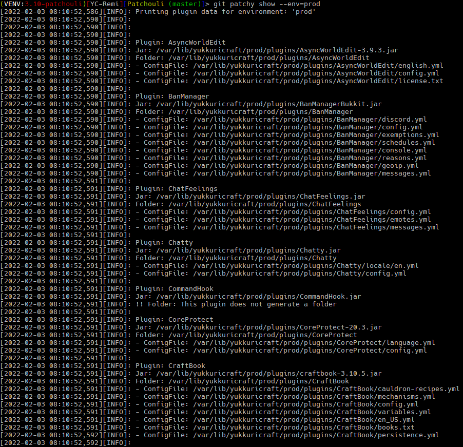

# Patchouli - A Multi-env Minecraft Config Management and VCS Tool

## Description
Patchouli is a tool that aims to allow Minecraft server administrators to manage server and plugins configs in a multi-environment setup. Developing and testing on a production server is both risky and potentially disruptive to players. By using a multi-environment setup, administrators are able to test and validate changes before applying them to the production environment.

However, managing configurations and plugins in multiple environments poses the problem of safely and reliably copying appropriate configs and plugins as well as version controlling changes. Patchouli aims to solve this problem by creating a `git` integrated tool to help automate these processes.

#### Use Case
This tool was created to be used in conjunction with [Yukkuricraft/Yukkuricraft](../Yukkuricraft) to manage configs in a multi-env containerized setup for the [Yukkuricraft](https://yukkuricraft.net) Minecraft server.

## Using Patchouli
Patchouli is to be used as a `git` subcommand.

### Pre-Requisites
- Python 3.10

### Installation
To install, simply run:
- `./setup.sh`

This will do several things:
- Create a virtualenv using `python3 -m venv` in this directory.
- Add a shebang to `git-patchy` to direct the shell to use the virtualenv python bin
- `pip3 install -r requirements.txt`
- Symlink `git-patchy` to `/usr/bin/git-patchy` so it can be used as a git subcommand.

## Usage

|Command|Description|
|-------|-----------|
|`git patchy help`||
| This Is Being ReWritten | Aaaaaaa|

## Others
- [Spec...?](docs/specs.md)

## TODO: Write Me
